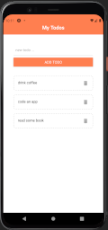

**Coding a simple React-Native To-Do-List App**

 

> Using new React-Native components like TouchableWithoutFeedback, Keyboard
>
> Adding icons with @expo/vector-icons
>
> Testing mobile rendering with Expo App or Virtual Android

 

Special Thx to [The Net Ninja](https://www.youtube.com/channel/UCW5YeuERMmlnqo4oq8vwUpg) 😉

 

